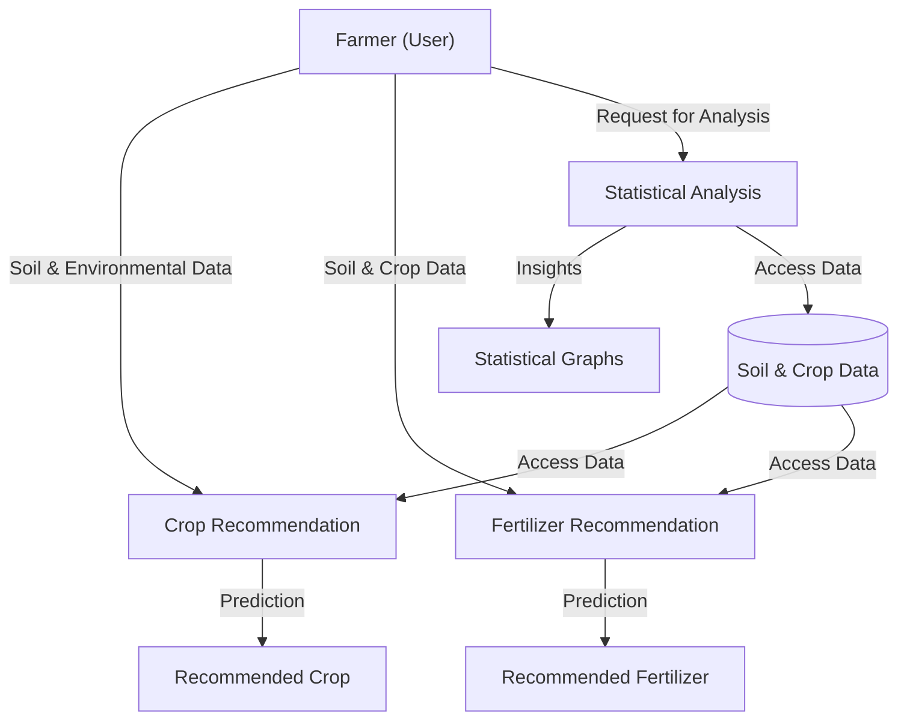
``` mermaid
graph TD
    Farmer["Farmer (User)"]
    CropRec["Crop Recommendation"]
    FertRec["Fertilizer Recommendation"]
    StatAnalysis["Statistical Analysis"]
    Output1["Recommended Crop"]
    Output2["Recommended Fertilizer"]
    Graphs["Statistical Graphs"]
    Database[("Soil & Crop Data")]

    Farmer -->|Soil & Environmental Data| CropRec
    Farmer -->|Soil & Crop Data| FertRec
    Farmer -->|Request for Analysis| StatAnalysis

    CropRec -->|Prediction| Output1
    FertRec -->|Prediction| Output2
    StatAnalysis -->|Insights| Graphs

    Database -->|Access Data| CropRec
    Database -->|Access Data| FertRec
    StatAnalysis -->|Access Data| Database

```

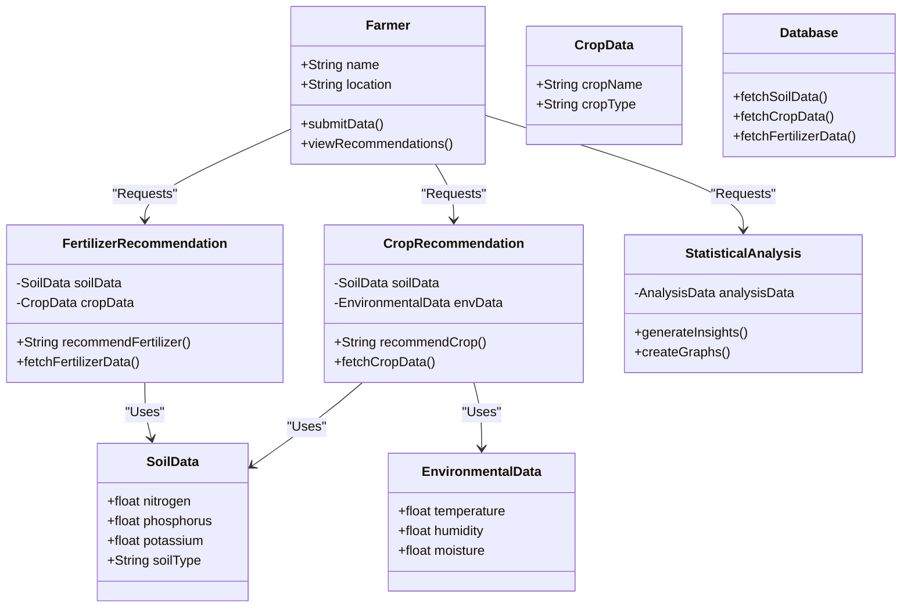
``` mermaid
classDiagram
    Farmer --> CropRecommendation : "Requests"
    Farmer --> FertilizerRecommendation : "Requests"
    Farmer --> StatisticalAnalysis : "Requests"
    
    class Farmer {
        +String name
        +String location
        +submitData()
        +viewRecommendations()
    }

    class CropRecommendation {
        -SoilData soilData
        -EnvironmentalData envData
        +String recommendCrop()
        +fetchCropData()
    }

    class FertilizerRecommendation {
        -SoilData soilData
        -CropData cropData
        +String recommendFertilizer()
        +fetchFertilizerData()
    }

    class StatisticalAnalysis {
        -AnalysisData analysisData
        +generateInsights()
        +createGraphs()
    }

    class SoilData {
        +float nitrogen
        +float phosphorus
        +float potassium
        +String soilType
    }

    class EnvironmentalData {
        +float temperature
        +float humidity
        +float moisture
    }

    class CropData {
        +String cropName
        +String cropType
    }

    class Database {
        +fetchSoilData()
        +fetchCropData()
        +fetchFertilizerData()
    }

    CropRecommendation --> SoilData : "Uses"
    CropRecommendation --> EnvironmentalData : "Uses"
    FertilizerRecommendation --> SoilData : "Uses"
    Fertilize
```

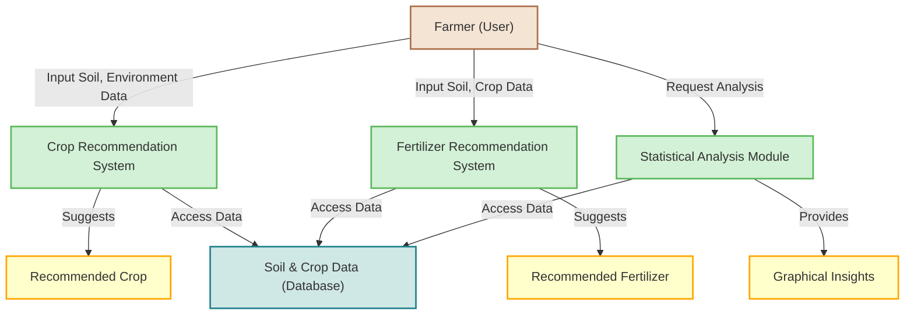
``` mermaid
graph TD
    Farmer["Farmer (User)"] -->|"Input Soil, Environment Data"| CropRecommendation["Crop Recommendation System"]
    Farmer -->|"Input Soil, Crop Data"| FertilizerRecommendation["Fertilizer Recommendation System"]
    Farmer -->|"Request Analysis"| StatisticalAnalysis["Statistical Analysis Module"]

    CropRecommendation -->|"Suggests"| CropOutput["Recommended Crop"]
    FertilizerRecommendation -->|"Suggests"| FertilizerOutput["Recommended Fertilizer"]
    StatisticalAnalysis -->|"Provides"| GraphicalInsights["Graphical Insights"]

    CropRecommendation -->|"Access Data"| Database["Soil & Crop Data (Database)"]
    FertilizerRecommendation -->|"Access Data"| Database
    StatisticalAnalysis -->|"Access Data"| Database

    style Farmer fill:#f4e4d3,stroke:#aa704d,stroke-width:2px
    style Database fill:#cfe7e5,stroke:#24828f,stroke-width:2px
    style CropRecommendation fill:#d2f1d6,stroke:#5cb85c,stroke-width:2px
    style FertilizerRecommendation fill:#d2f1d6,stroke:#5cb85c,stroke-width:2px
    style StatisticalAnalysis fill:#d2f1d6,stroke:#5cb85c,stroke-width:2px
    style CropOutput fill:#ffffcc,stroke:#ffa500,stroke-width:2px
    style FertilizerOutput fill:#ffffcc,stroke:#ffa500,stroke-width:2px
    style GraphicalInsights fill:#ffffcc,stroke:#ffa500,stroke-width:2px
```

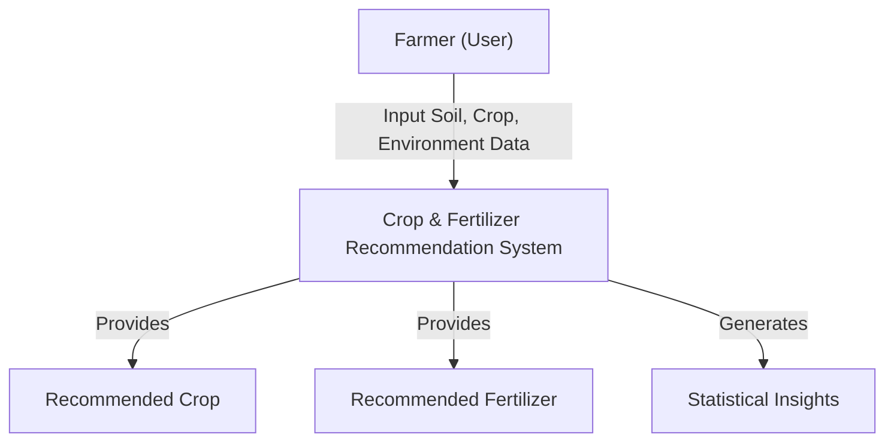
```mermaid
graph TD
    Farmer["Farmer (User)"] -->|Input Soil, Crop, Environment Data| System["Crop & Fertilizer Recommendation System"]
    System -->|"Provides"| CropOutput["Recommended Crop"]
    System -->|"Provides"| FertilizerOutput["Recommended Fertilizer"]
    System -->|"Generates"| Insights["Statistical Insights"]
```

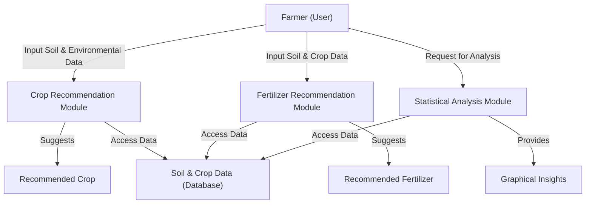
```mermaid
graph TD
    Farmer["Farmer (User)"]
    Database["Soil & Crop Data (Database)"]

    Farmer -->|"Input Soil & Environmental Data"| CropRecommendation["Crop Recommendation Module"]
    Farmer -->|"Input Soil & Crop Data"| FertilizerRecommendation["Fertilizer Recommendation Module"]
    Farmer -->|"Request for Analysis"| StatisticalAnalysis["Statistical Analysis Module"]

    CropRecommendation -->|"Suggests"| CropOutput["Recommended Crop"]
    FertilizerRecommendation -->|"Suggests"| FertilizerOutput["Recommended Fertilizer"]
    StatisticalAnalysis -->|"Provides"| Insights["Graphical Insights"]

    CropRecommendation -->|"Access Data"| Database
    FertilizerRecommendation -->|"Access Data"| Database
    StatisticalAnalysis -->|"Access Data"| Database
```

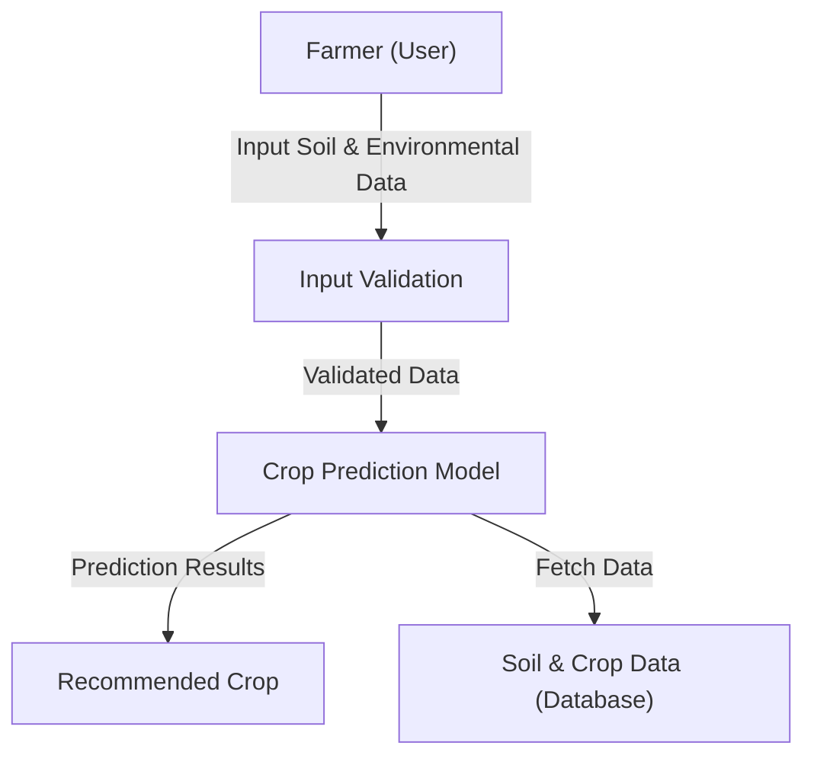
```mermaid
graph TD
    Farmer["Farmer (User)"]
    Database["Soil & Crop Data (Database)"]

    Farmer -->|"Input Soil & Environmental Data"| InputValidation["Input Validation"]
    InputValidation -->|"Validated Data"| CropModel["Crop Prediction Model"]
    CropModel -->|"Prediction Results"| CropOutput["Recommended Crop"]

    CropModel -->|"Fetch Data"| Database
```

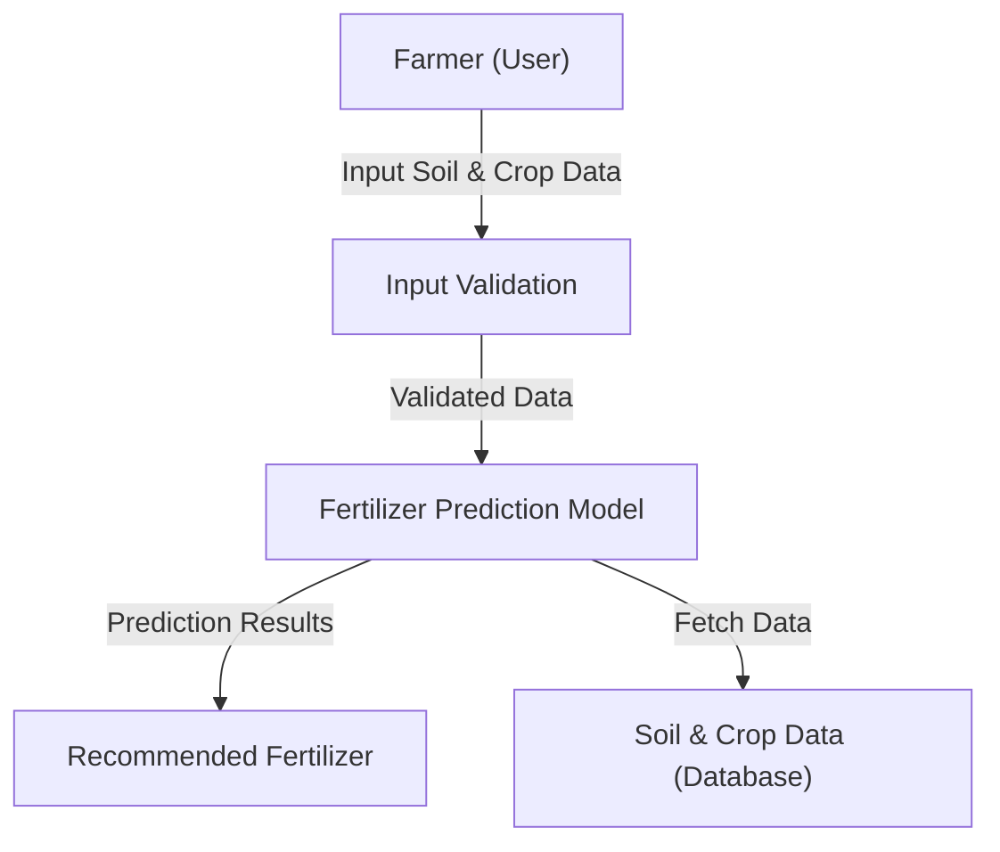
```mermaid
graph TD
    Farmer["Farmer (User)"]
    Database["Soil & Crop Data (Database)"]

    Farmer -->|"Input Soil & Crop Data"| InputValidation["Input Validation"]
    InputValidation -->|"Validated Data"| FertModel["Fertilizer Prediction Model"]
    FertModel -->|"Prediction Results"| FertilizerOutput["Recommended Fertilizer"]

    FertModel -->|"Fetch Data"| Database
```
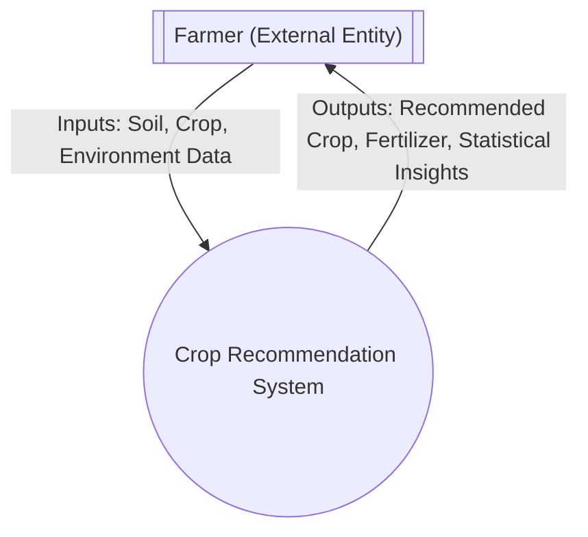
```mermaid
graph TD
    extEntity[["Farmer (External Entity)"]] -->|Inputs: Soil, Crop, Environment Data| process0(("Crop Recommendation System"))
    process0 -->|Outputs: Recommended Crop, Fertilizer, Statistical Insights| extEntity
```
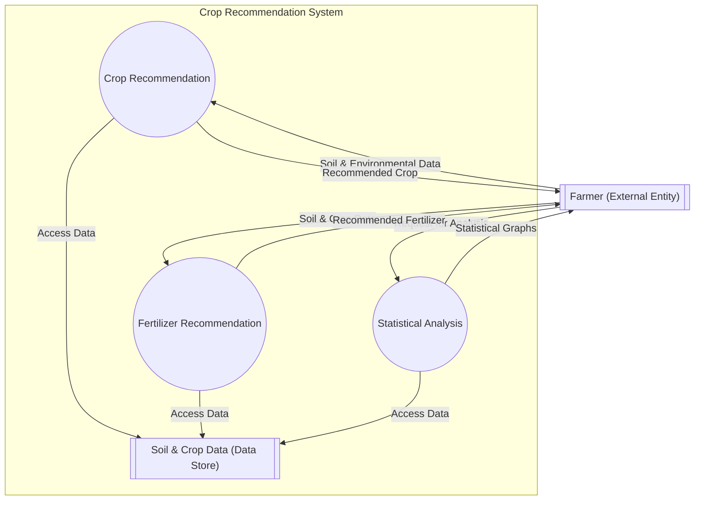
```mermaid
graph TD
    subgraph System["Crop Recommendation System"]
        process1(("Crop Recommendation"))
        process2(("Fertilizer Recommendation"))
        process3(("Statistical Analysis"))
        datastore1[["Soil & Crop Data (Data Store)"]]
    end

    extEntity[["Farmer (External Entity)"]] -->|Soil & Environmental Data| process1
    extEntity -->|Soil & Crop Data| process2
    extEntity -->|Request for Analysis| process3

    process1 -->|Recommended Crop| extEntity
    process2 -->|Recommended Fertilizer| extEntity
    process3 -->|Statistical Graphs| extEntity

    process1 -->|Access Data| datastore1
    process2 -->|Access Data| datastore1
    process3 -->|Access Data| datastore1
```
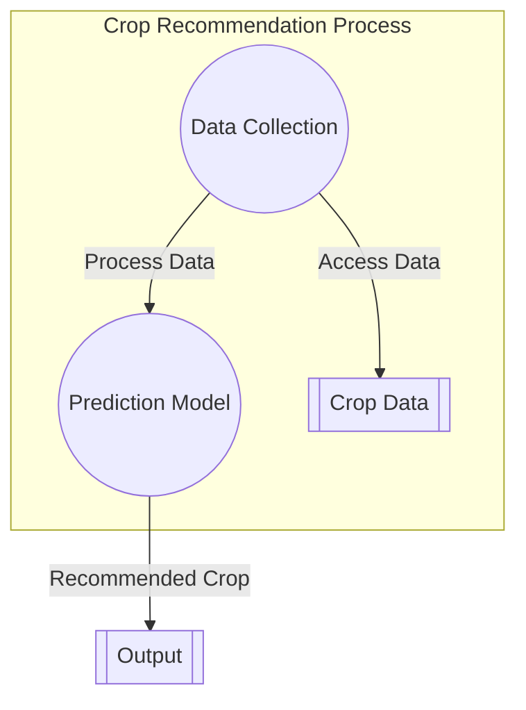
```mermaid
graph TD
    subgraph CropRecommendationProcess["Crop Recommendation Process"]
        subproc1(("Data Collection"))
        subproc2(("Prediction Model"))
        datastoreCrop[["Crop Data"]]
    end

    subproc1 -->|Process Data| subproc2
    subproc2 -->|Recommended Crop| outputCrop[["Output"]]
    subproc1 -->|Access Data| datastoreCrop
```

```mermaid
graph TD
    subgraph CropRecommendationProcess["Crop Recommendation Process"]
        subproc1(("Data Collection"))
        subproc2(("Prediction Model"))
        datastoreCrop[["Crop Data"]]
    end

    subproc1 -->|Process Data| subproc2
    subproc2 -->|Recommended Crop| outputCrop[["Output"]]
    subproc1 -->|Access Data| datastoreCrop
```

```mermaid
graph TD
    subgraph CropRecommendationProcess["Crop Recommendation Process"]
        subproc1(("Data Collection"))
        subproc2(("Prediction Model"))
        datastoreCrop[["Crop Data"]]
    end

    subproc1 -->|Process Data| subproc2
    subproc2 -->|Recommended Crop| outputCrop[["Output"]]
    subproc1 -->|Access Data| datastoreCrop
```
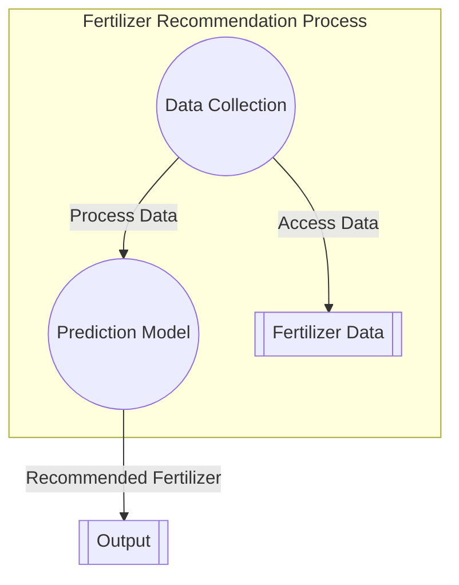
```mermaid
graph TD
    subgraph FertilizerRecommendationProcess["Fertilizer Recommendation Process"]
        subproc1(("Data Collection"))
        subproc2(("Prediction Model"))
        datastoreFert[["Fertilizer Data"]]
    end

    subproc1 -->|Process Data| subproc2
    subproc2 -->|Recommended Fertilizer| outputFert[["Output"]]
    subproc1 -->|Access Data| datastoreFert
```
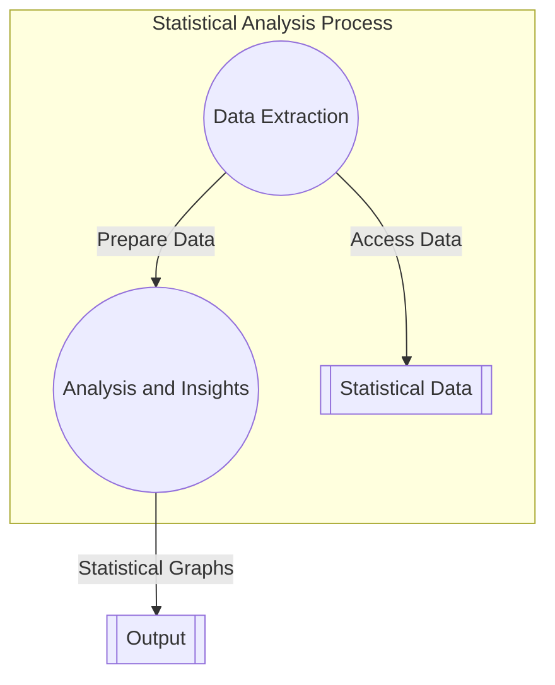
```mermaid
graph TD
    subgraph StatisticalAnalysisProcess["Statistical Analysis Process"]
        subproc1(("Data Extraction"))
        subproc2(("Analysis and Insights"))
        datastoreStat[["Statistical Data"]]
    end

    subproc1 -->|Prepare Data| subproc2
    subproc2 -->|Statistical Graphs| outputGraphs[["Output"]]
    subproc1 -->|Access Data| datastoreStat
```
